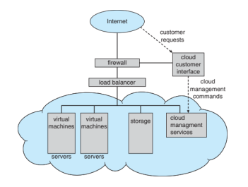

# Operating Systems

## Introduction

- **Operating System**: A program that acts as an intermediary between a user of a computer and the computer hardware. i.e. It provides a user interface and manages resources.
- **Computer System**: Hardware, Operating System, Application Programs, Users.
- **Computer System Organization**:
  - **Computer Hardware**: Provides basic computing resources.
  - **Operating System**: Controls and coordinates the use of the hardware among the various application programs for various users.
  - **Application Programs**: Define the ways in which the system resources are used to solve the computing problems of the users.
  - **Users**: People, machines, other computers.

- **Kernel**: The one program running at all times on the computer.
- **System Programs**: Associated with the OS but not necessarily part of the kernel.
- **Application Programs**: Any other programs that are not associated with the OS.
- **Middleware**: Software that lies between the OS and the application programs. Might be shipped with the OS or might be developed by a third party.

### Kernel

- The one program running at all times on the computer.
- Kernel data structures:
  - **Singly Linked List**: Each element points to the next element.
  - **Doubly Linked List**: Each element points to the next and the previous element.
  - **Circular Linked List**: The last element points to the first element.
  - **Binary Search Tree**: Each node has at most two children.
  - **Hash Map**: Key-value pairs. uses a hash function to map keys to values.
  - **Bitmap**: A sequence of bits.

## Computer System Structure

- Device controllers and CPUs can execute concurrently.
- They all compete for memory cycles.

- **Device Controllers**
  - Each controller is in charge of a specific device type.
  - Each controller has a local buffer.
  - CPU moves data between main memory and local buffers.

### Interrupt-driven systems

- **Interrupt**: Signal sent from a device or a software to the CPU to inform it that it needs **immediate attention**.
- **Trap/Exception**: Software-generated interrupt.

### Interrupt Handling

- **Interrupt Vector**: Contains the addresses of all the interrupt service routines.
- **Interrupt Service Routine**: Handles a specific interrupt. Is a part of the OS.

- When an interrupt occurs:
  1. Stops its current execution.
  2. Saves its state (like registers, program counter).
  3. Looks up the _interrupt_ using the _interrupt vector_ to find the address of the appropriate _interrupt service routine_.
  4. Jumps to that interrupt service routine to handle the interrupt.
  5. Once the interrupt service routine completes, the CPU restores its saved state and resumes execution.

## Computer-System Architecture

### Multiprocessor Systems

- Two or more processors share the computer bus and the clock.
- Advantages:

  - Increased throughput.
  - Economy of scale.
  - Increased reliability.

- **Asymmetric Multiprocessing**: Each processor is assigned a specific task.
- **Symmetric Multiprocessing**: Each processor performs all tasks.
  

### Dual-Core Design

- Multiple processors on a single chip.
- Chassis can have multiple chips.

### Non-Uniform Memory Access (NUMA) System

- Each processor has its own local memory.
- Access to another processor's memory is slower than access to its own memory.

### Clustered Systems

- Multiple systems working together. Each system is a node.
- Advantages:

  - Scalability.
  - High availability: If one node fails, the other nodes can take over.

- **Asymmetric Clustering**: One machine is in hot standby mode.
  Hot standby machine takes over if the main machine fails.
- **Symmetric Clustering**: Multiple nodes running applications and monitoring each other.

## Operating System Operations

1. **Bootstrap Program**:
   - Initializes all aspects of the system.
   - Loads the OS kernel and starts its execution.
   - Usually stored in ROM.
2. **Kernel**:
   - The one program running at all times on the computer.
   - Starts system deamons.
3. **System deamons**:
   - Background processes outside the kernel.
   - Started by the kernel.

### Dual-mode Operation

- Allows the OS to protect itself and other system components.
- **User mode**: running user programs.
- **Kernel mode**: executing OS code. Has access to privileged instructions.
- **Mode bit**: Indicates the current mode.
- **System calls**:
  - Requests to the OS to allow user programs to execute privileged instructions.
  - Changes the mode bit to kernel mode and changes it back to user mode after execution.

### Timer

- Prevents a user program from running indefinitely.
- Set a timer to interrupt the computer after a certain time.
  - Timer value is decremented every physical clock tick.
  - When the timer reaches 0, an interrupt occurs.
- Operating System sets the timer value (Privileged instruction).

## Process Management

- **Process**: a program in execution.

| Process                    | Program        |
| -------------------------- | -------------- |
| Active entity              | Passive entity |
| Needs resources (CPU, I/O) | Instructions   |

- **Thread**: a basic unit of CPU utilization.
  - A process can have multiple threads.
  - Each thread has its own program counter, register set, and stack space.
  - Threads share the code section, data section, and OS resources.

### Process Management Activities

- OS is responsible for the following activities:
  - **Creation and deletion of user and system processes**.
  - **Suspension and resumption of processes**.
  - **Provision of mechanisms for process synchronization**.
  - **Provision of mechanisms for process communication**.
  - **Deadlock handling**.

### Multi-programming (Batch Systems)

- **Multi-programming**: Several programs are loaded into main memory at the same time.
- **Batch Systems**: Jobs with similar needs are batched together and run through the computer as a group.
- **CPU scheduling**:
  - Selects which job to run next.
  - **Swapping**: moveing jobs in and out of memory.
  - **Virtual memory**: Allows jobs to be larger than physical memory.
  - When a job waits, the OS switches to another job.

### Multi-tasking (Time-sharing Systems)

- **Multi-tasking**: CPU switches jobs so frequently that users can interact with each job while it is running.
- This allows interactive use of the system.
  - Response time should be < 1 second.
  - Each user has at least one program loaded in memory.
  - If several jobs are ready to run at the same time, the OS must decide which one to run.

## Memory Management

- Activities:
  - **Keeping track of which parts of memory are currently being used**.
  - **Deciding which processes to load when memory space becomes available**.
  - **Allocating and de-allocating memory space as needed**.

### Storage definitions and notations

- **Bit**: Smallest unit of data.
- **Byte**: Smallest addressable unit of memory. 8 bits.
- **Word**: Natural unit of data used by a particular computer design.
- **Computer storage units**: 1024 multiples of bytes.

### Storage Hierarchy

- **Main Memory**: Only large storage media that the CPU can access directly.
- **Secondary Storage**: Extension of main memory that provides large nonvolatile storage capacity.

## File-System Management

- OS provides a file-system to manage files.
- **File**: A collection of related information. An abstraction provided by the OS.
- OS contols access to files.
- Activities:
  - **Creating and deleting files and dirs**.
  - **Supporting primitives for manipulating files and directories**.
  - **Mapping files onto secondary storage**.
  - **Backup files onto stable storage media**.

## Cacheing

- Perfomed at many levels in a computer system.
- Information in use is copied to faster storage system.

| Level | Name             | Typical size | Implementation technology              | Access time (ns) | Bandwidth (MB/sec) | Managed by       | Backed by    |
| ----- | ---------------- | ------------ | -------------------------------------- | ---------------- | ------------------ | ---------------- | ------------ |
| 1     | registers        | < 1 KB       | custom memory with multiple ports CMOS | 0.25-0.5         | 20,000-100,000     | compiler         | cache        |
| 2     | cache            | < 16MB       | on-chip or off-chip CMOS SRAM          | 0.5-25           | 5,000-10,000       | hardware         | main memory  |
| 3     | main memory      | < 64GB       | CMOS SRAM                              | 80-250           | 1,000-5,000        | operating system | disk         |
| 4     | solid-state disk | < 1 TB       | flash memory                           | 25,000-50,000    | 500                | operating system | disk         |
| 5     | magnetic disk    | < 10 TB      | magnetic disk                          | 5,000,000        | 20-150             | operating system | disk or tape |

- **Cache coherency**: Ensuring that changes in the values of shared variables are propagated throughout the system in a timely manner.

## I/O Management

### I/O Structure

- **Synchronous I/O**: The process waits for the I/O operation to complete.
- **Asynchronous I/O**: The process continues to execute while the I/O operation is in progress.

#### Synchrounous I/O

- **Wait loop**: CPU polls to check whether I/O operation is complete.
  - Contention for memory cycles. CPU is busy waiting.
- No simultaneous I/O operations. because the CPU is busy waiting and cannot make another I/O request.

#### Asynchronous I/O

- This is interrupt-driven.
- **System Call**: Request to the OS to allow the user program to wait for I/O completion.

### I/O Subsystem

- The I/O subsystem consists of:
  - **I/O devices**.
  - **Device controllers**.
  - **Device drivers**.
  - **Interrupt handlers**.

## Protection and Security

- **Protection**: Any mechanism for controlling access of processes or users to resources defined by the OS.
- **Security**: Defense of the system against internal and external attacks.

- **User IDs**:
  - Unique identifiers for each user.
  - Associated with each process and files.
- **Group IDs**:

  - Each group has a unique identifier.
  - Users can be assigned to groups.
  - Groups can be assigned access rights to files and processes.

- **Privillege Escalation**: Allows a user gains more privileges than they originally have.

## Virtualization

- Allows operating systems to run programs within other operating systems.

### Emulation

- The process of simulating hardware using software.
- Used to run programs on a platform other than the one they were originally written for.
- Generally slower.

### Virtualization

- Natively compiled **host OS** running **guest OS**es which are also natively compiled.
- Generally faster.
- **Virtual Machine Monitor (VMM)**: Software that provides an interface between the guest OS and the host OS.

## Von Neumann Architecture

- **Von Neumann Machine**: Consists of a CPU, memory, and I/O devices.

### Direct Memory Access (DMA)

- Device controller transfers blocks of data directly between local buffer and memory without CPU intervention.
- Only one interrupt is generated per block, not per byte.

## Distributed Systems

- A collection of independent computers that appear to the users as a single coherent system.
- Uses a network to connect computers.

## Computing Environments

- Defined by the users and the computers and their interconnections.

### Traditional

- Standalone general-purpose computers.

### Mobile

- Smartphones, tablets, and other handheld devices.
- vs. Traditional:
  - Limited resources.
  - Limited power.
  - Limited storage.
  - Limited network bandwidth.

### Client-Server

- Clients request services from servers.

### Peer-to-Peer

- Each computer can act as a client or a server.

### Cloud Computing

- Provides services over the internet.
- vs. Client-Server:
  - Clients do not have to be powerful.
  - Clients do not have to be online all the time.
  - Clients do not have to run the same OS as the server.

### Real-time Embedded Systems

- Used in:
  - Consumer electronics.
  - Medical devices.
  - Military systems.
  - Industrial systems.
- **Real-time**: Responds to stimuli within a limited time.
