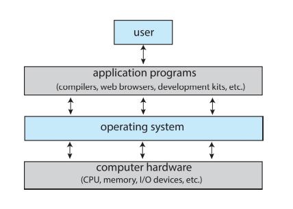
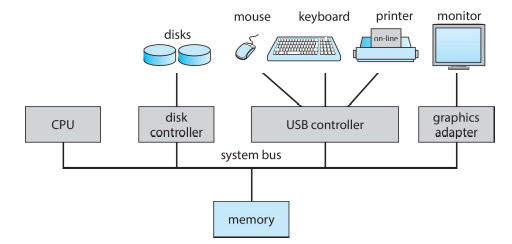

# Operating Systems

## Introduction

- **Operating System**: A program that acts as an intermediary between a user of a computer and the computer hardware. i.e. It provides a user interface and manages resources.
- **Computer System**: Hardware, Operating System, Application Programs, Users.
- **Computer System Organization**:
  - **Computer Hardware**: Provides basic computing resources.
  - **Operating System**: Controls and coordinates the use of the hardware among the various application programs for various users.
  - **Application Programs**: Define the ways in which the system resources are used to solve the computing problems of the users.
  - **Users**: People, machines, other computers.

- **Kernel**: The one program running at all times on the computer.
- **System Programs**: Associated with the OS but not necessarily part of the kernel.
- **Application Programs**: Any other programs that are not associated with the OS.
- **Middleware**: Software that lies between the OS and the application programs. Might be shipped with the OS or might be developed by a third party.

## Computer System Structure

- Device controllers and CPUs can execute concurrently.
- They all compete for memory cycles.
- An OS is **interrupt-driven**.

### Device Controllers

- Each controller is in charge of a specific device type.
- Each controller has a local buffer.
- CPU moves data between main memory and local buffers.
- **Interrupt**: Signal sent from a device or a software to the CPU to inform it that it needs **immediate attention**.
- **Trap/Exception**: Software-generated interrupt.

### Interrupt Handling

- **Interrupt Vector**: Contains the addresses of all the interrupt service routines.
- **Interrupt Service Routine**: Handles a specific interrupt. Is a part of the OS.

- When an interrupt occurs:
    1. Stops its current execution.
    2. Saves its state (like registers, program counter).
    3. Looks up the *interrupt* using the *interrupt vector* to find the address of the appropriate *interrupt service routine*.
    4. Jumps to that interrupt service routine to handle the interrupt.
    5. Once the interrupt service routine completes, the CPU restores its saved state and resumes execution.

### I/O Structure

- **Synchronous I/O**: The process waits for the I/O operation to complete.
- **Asynchronous I/O**: The process continues to execute while the I/O operation is in progress.

#### Synchrounous I/O

- **Wait loop**: CPU polls to check whether I/O operation is complete.
  - Contention for memory cycles. CPU is busy waiting.
- No simultaneous I/O operations. because the CPU is busy waiting and cannot make another I/O request.

#### Asynchronous I/O

- This is interrupt-driven.
- **System Call**: Request to the OS to allow the user program to wait for I/O completion.

## Storage Structure

### Definitions and notations

- **Bit**: Smallest unit of data.
- **Byte**: Smallest addressable unit of memory. 8 bits.
- **Word**: Natural unit of data used by a particular computer design.
- **Computer storage units**: 1024 multiples of bytes.

### Storage Hierarchy

- **Main Memory**: Only large storage media that the CPU can access directly.
- **Secondary Storage**: Extension of main memory that provides large nonvolatile storage capacity.

## Von Neumann Architecture

- **Von Neumann Machine**: Consists of a CPU, memory, and I/O devices.

### Direct Memory Access (DMA)

- Device controller transfers blocks of data directly between local buffer and memory without CPU intervention.
- Only one interrupt is generated per block, not per byte.

