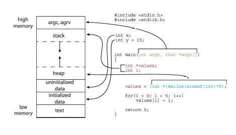
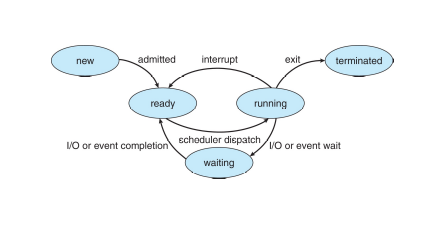
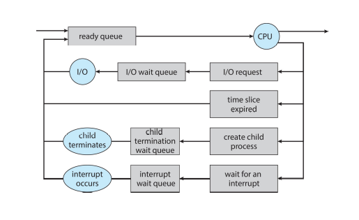
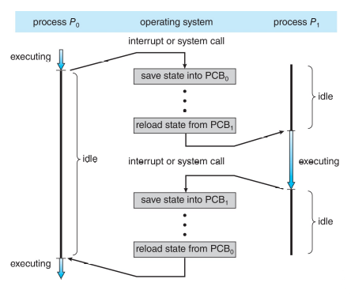
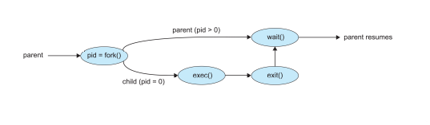
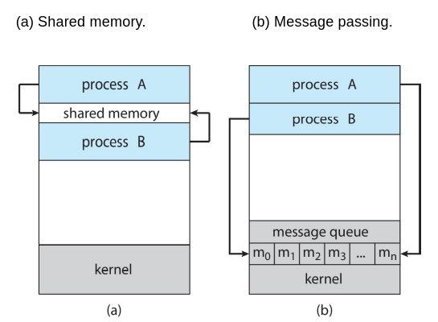
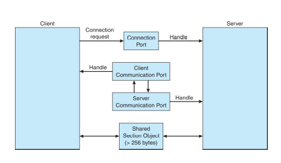
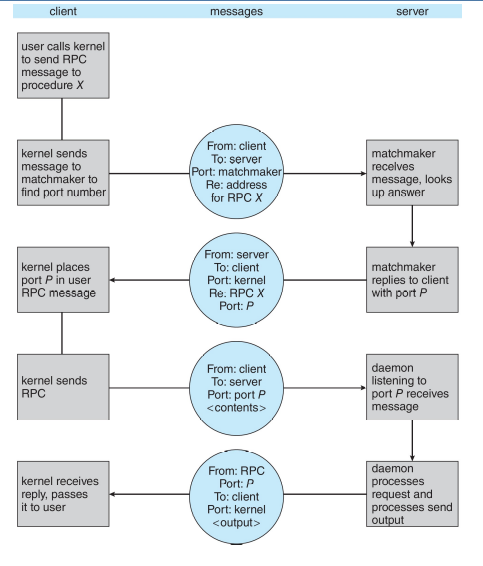

# Processes

## Process Concept

- A **process** is a program in execution.
- Parallel execution of instructions does not happen inside a process.
- Parts of a process:
  - **Text Section**: Program code.
  - **Program Counter**: Points to the next instruction.
  - **Processors Registers**
  - **Stack**:
    - Contains temporary data.
    - Function parameters, return addresses, local variables.
  - **Data Section**: Contains global variables.
  - **Heap**: Memory dynamically allocated during runtime.

> A _program_ is a passive entity, like a executable file.
> It becomes a _process_ when it is loaded into memory and executed.

### Process memory layout

### Process State

- **New**: The process is being created.
- **Running**: Instructions are being executed.
- **Waiting**: The process is waiting for some event to occur.
- **Ready**: The process is waiting to be assigned to a processor.
- **Terminated**: The process has finished execution.

### Process Control Block (PCB)

- Contains information about the process.
- The PCB is stored in the kernel. It is used to manage the process.

#### Contents of a single-threaded PCB

- **Process State**: State of the process.
- **Program Counter**: Address of the next instruction.
- **CPU Registers**: Contents of all the CPU registers.
- **CPU Scheduling Information**: Priority, pointers to scheduling queues.
- **Memory Management Information**: Memory allocated to the process.
- **Accounting Information**: Amount of CPU and real time used, time limits, account numbers.
- **I/O Status Information**: List of I/O devices allocated to the process.

### Threads

- A **thread** is a basic unit of CPU utilization.
- A process can have multiple threads.
- Each thread has its own:
  - **Program Counter**
  - **Registers**
  - **Stack**
- Threads share the same:
  - **Code Section**
  - **Data Section**
  - **Operating System Resources**
- The PCB contains information about each thread and multiple program counters.

## Process Scheduling

- **Process Scheduler**: Selects a process from the ready queue and assigns it to the CPU.
- **Ready Queue**: Contains all the processes in the ready state.

- **Context Switch**:
  - Switching the CPU from one process to another.
  - The time taken to switch the CPU is known as the **context switch time**.
  - This is pure overhead.
  - The context switch time is dependent on hardware support.

- **Dispatcher**: Saves the state of the current process and loads the state of the next process.

## Operations on Processes

### Process Creation

- **Parent Process**: The process that creates a new process.
- **Child Process**: The newly created process.
- **Process ID**: Unique identifier for each process.

- **Resource Sharing**: 3 possible cases:

  - Parent and child share all resources.
  - Parent and child share no resources.
  - Some resources are shared, some are not

- **Execution**: 2 possible cases:

  - The parent and child processes execute concurrently.
  - The parent waits for the child to finish.

- **Address Space**: 2 possible cases:
  - The child process is a duplicate of the parent process.
  - The child process has a new program loaded into it.

> Unix systems:
>
> - `fork()`: System call to create a new process.
> - `exec()`: System call to load a new program into the process.
> - `wait()`: Parent waits for the child to finish.
>   

### Process Termination

- **Exit()**:
  - Process executes its last statement and asks the operating system to delete it.
  - The process may return a status data to the parent process. This value is retured by the `wait()` system call by the parent process.
- **Abort()**:

  - Terminates the process when called.
  - Used when:
    - The parent process terminates the child process.
    - The parent process is terminated (Some OSs do not allow child processes to continue if the parent process is terminated).
    - The process is a threat to the system.

- **Zombie Process**: If the parent process does not call `wait()`.
- **Orphan Process**: If the parent process terminates before the child process.

## Interprocess Communication (IPC)

- **Independent process**: Cannot affect or be affected by the execution of another process.
- **Cooperating process**: Can affect or be affected by the execution of another process.

> **Producer-Consumer paradigm**
>
> - Producer produces information and puts it in a buffer.
> - Two types:
>   - **Unbounded buffer**: The producer can produce as much as it wants.
>   - **Bounded buffer**: The producer can produce only if the buffer is not full.

### Shared Memory

- **Shared Memory**: A region of memory that is shared between processes.
- This communication is handled by the processes themselves.
- Needs additional synchronization.

### Message Passing

- Communication takes place by means of messages.
- OS is responsible for the communication.
- Two operations:
  - **send(message)**
  - **receive(message)**
- **Communication Link**: The link between the sender and receiver.
  - **Unidirectional**: One-way communication.
  - **Bidirectional**: Two-way communication.

#### Direct Communication

- Processes must name each other explicitly.
- Link:
  - established automatically.
  - Only one link is established between two processes.
  - May be unidirectional or bidirectional.

#### Indirect Communication

- Messages are sent to and received from mailboxes (ports).
  - There must be a shared mailbox to communicate.
- Link:
  - Established only if processes share a common mailbox.
  - A link may be associated with more than two processes.
  - There may be multiple links between two processes.
  - May be unidirectional or bidirectional.
- Operations:
  - **create a mailbox**
  - **send and receive messages through the mailbox**
  - **destroy the mailbox**
- Solutions to multiple reciever problem:
  - Allow a link to be associated with only two processes.
  - Allow only one process at a time to execute a receive operation.
  - Allow the system to select arbitrarily the receiver.
- Synchronization:
  - Send and receive operations may be blocking or non-blocking.
  - **Rendezvous**: Both blocking send and receive.
- Buffering:
  - **Zero capacity**: Sender must wait for the receiver.
  - **Bounded capacity**: Sender must wait if the buffer is full.
  - **Unbounded capacity**: Sender never waits.

### Examples of IPC Systems

#### Posix shared memory

- **shm_open()**: Creates or opens a shared memory object.
- **ftruncate()**: Sets the size of the shared memory object.
- **mmap()**:
  - Maps the shared memory object into the address space of the process.
  - Returns a pointer to the shared memory object, which can be used to read and write data.

#### Mach message passing

- **Mach**: Microkernel-based OS. Even system calls are done by message passing.
- Every task initially have _Kernel_ and _Notify_ ports.
- **mach_msg()**: System call to send and receive messages.
- **mach_port_allocate()**: Allocates a new port.
- Send and receive messages are flexible. If the mailbox is full,
  - Wait indefinitely.
  - Wait for n milliseconds.
  - Return immediately.
  - Temporarily cache the message.

#### Windows IPC

- via _advanced local procedure call_ (LPC) facility.
- Only works between processes on the same system.
- Uses ports.

- Communication:
  1. **Client** opens a handle to subsystem's **connection port**.
  2. Client sends a connection request.
  3. **Server** receives the request and creates two private **communication ports**.
  4. Server sends the client a handle to one of the communication ports.
  5. Those handles enable two-way communication.

#### Pipes

- Allow communication between processes.
- **Ordinary pipes**:
  - Unidirectional.
  - Parent and child processes.
  - In windows, it is called **anonymous pipe**.
- **Named pipes**:
  - Two-way communication.
  - Unrelated processes.
  - Several processes can use the pipe.
  - Provided in both Unix and Windows.

### Communication in Client-Server Systems

#### Sockets

- **Socket**: Endpoint for communication.
- **Socket Pair**: Two sockets that can communicate.

> - Ports below 1024 are reserved for system services.
> - _127.0.0.1 (loopback)_ is a special IP address that refers to the local machine.

#### Remote Procedure Calls (RPC)

- **RPC**: Procedure call that executes on a different address space.
- Client-Server Model:
  - Client: Initiates the call.
  - Server: Executes the call.
- **Marshalling**: Converting the parameters to a standard format.
- **Unmarshalling**: Converting the standard format to the local format.
- **Stubs**: Client-side and server-side code that acts as a proxy for the actual procedure.

