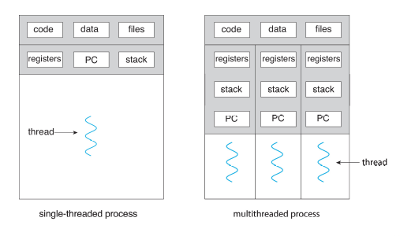
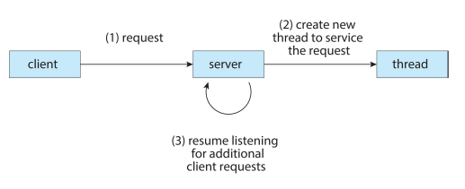
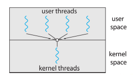
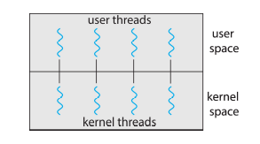
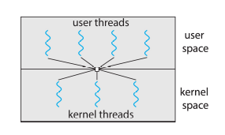
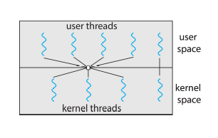
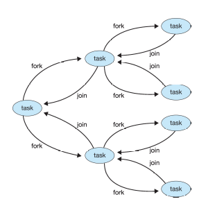
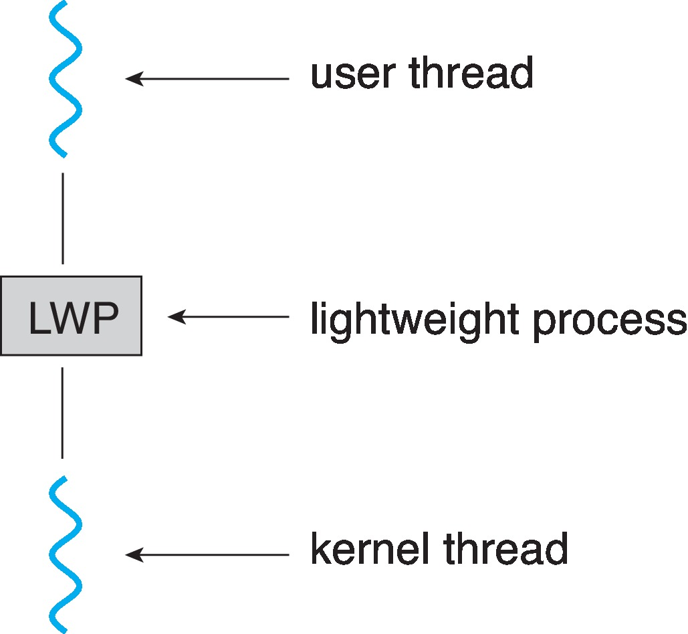
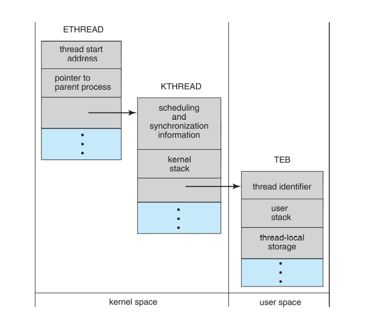

# Threads & Concurrency

## Overview

- **Thread**: A basic unit of CPU utilization.
- A process can have multiple threads.

- Benefits of threads:
  - **Responsiveness**: A program can continue running even if part of it is blocked. Escpecially useful for GUIs.
  - **Resource Sharing**: Threads share the same address space.
  - **Economy**: Threads are cheaper to create than processes. Thread switching is faster than context switching.
  - **Scalability**: Processes can take advantage of multi-core systems.

> Multithreaded Server Architecture:
> 

## Multicore Programming

- **Multicore**: A CPU with multiple cores.
- Challenges:

  - Dividing activities into tasks that can be executed concurrently.
  - Balance the work between the cores.
  - Minimize communication between cores.
  - Data dependency between tasks.
  - Testing and debugging.

- parallelism vs concurrency

  - **Parallelism**: Multiple tasks are executed simultaneously.
  - **Concurrency**: Multiple tasks are making progress.
  - Parallelism requires concurrency, but not vice versa.

- Types of parallelism:
  - **Data parallelism**: Multiple threads perform the same operation on different data.
  - **Task parallelism**: Multiple threads perform different operations on the same data.

### Amdahl's Law

- **Amdahl's Law**: The speedup of a program using multiple processors in parallel computing is limited by the time needed for the sequential fraction of the program.
- Amdahl's Law shows that no matter how many processors are added, the maximum speedup is constrained by the sequential part of the task.

$$
\text{Speedup} = \frac{1}{(1 - P) + \frac{P}{N}}
$$

- $P$: Fraction of the program that can be parallelized.
- $N$: Number of processors.

- This law does apply to multicore systems, but it's not perfect.
  - The law does not consider the cost of communication between processors.
  - Caching and memory bandwidth can also affect the speedup.
  - The law assumes uniform processors.

### User threads vs Kernel threads

- **User threads**: Managed by the user-level threads library.
- **Kernel threads**: Managed by the kernel.
- User threads can't run by themselves. They need kernel threads to run.
- OS actually schedules kernel threads.
- Only one user thread can be run on a kernel thread at a time.

## Multithreading Models

- Defines how many kernel threads are in a process and how user threads are run

### Many-to-One Model

- Many user-level threads mapped to a single kernel thread.
- If a user thread blocks, the entire process blocks.
- Few systems use this model.

### One-to-One Model

- Each user-level thread maps to a kernel thread.
- If a user thread blocks, the kernel can schedule another thread.
- The most commmon model.

### Many-to-Many Model

- Many user-level threads mapped to many kernel threads.
- Uncommon (Used in Windows with ThreadFiber)

### Two-level Model

- Similar to many-to-many but allows some user threads to bind to a kernel thread.
- Optimized because allows map based on the priority.

## Thread Libraries

- Provides API for creating and managing threads.
- Two primary ways to implement:
  - Library entirely in user space.
  - Kernel-level library supported by the OS.

### Pthreads

- **Pthreads**: POSIX standard for thread creation and synchronization.
- This is a specification (May be implemented in user space or kernel space).
- Common in UNIX systems.

### Java Threads

- Java has built-in support for threads.
- Managed by the JVM.
- Java threads are user-level threads.
- Creating:
  - Extending `Thread` class
  - Implementing `Runnable` interface (Common practice)

### Java Executors

- Executors are a higher-level API for managing threads.
- Executors can manage thread pools.

## Implicit Threading

- **Implicit Threading**: The compiler or runtime system automatically parallelizes the code.
- Programmer doesn't need to create or manage specific threads.

### Thread Pools

- **Thread Pool**: A group of threads that are created once and reused.
- Thread pools can improve performance by reducing the overhead of creating threads.
- When a task is submitted, it's added to a queue and executed by the next available thread.
- Windows API supports thread pools.
- Java Executors can manage thread pools.

### Fork-Join

- **Fork-Join**: A parallel programming model where a task is divided into smaller tasks.
- Similar to divide and conquer.
- Task run paralelly and then join back together.

### OpenMP

- **OpenMP**: A set of compiler directives for C, C++, and Fortran.
- Identifies parallel regions of code.

### Grand Central Dispatch

- **Grand Central Dispatch**: A technology developed by Apple for Mac OS X.
- Mark parllel regions of code.
- These blocks are placed in dispatch queue and gets assigned to next available thread in the pool.
- In swift, closures must be explicitly dispatched to a queue using `dispatch_async`.

### Intel Thread Building Blocks (TBB)

- **TBB**: A C++ template library for parallel programming.
- Provides equivalent control structures like for loops that can be parallelized.

## Threading Issues

### Fork and exec

- **Fork**: Creates a new process.
- **Exec**: Replaces the process with a new program.
- Problem:
  - When `fork()` creates a copy of the process with only one thread (the calling thread).
  - This can cause issues because the new process may not have the same state as the original process.
- Solution:
  - Use `exec()` after `fork()`.

### Signal Handling

- **Signal**: A notification to a process that an event has occurred.
- **Signal Handler**: Used to process signals.
  - default handler
  - user-defined handler (override default handler)
- Problem:
  - Where should the signal be delivered if multiple threads are running?
- Solutions:
  - Deliver the signal to the thread that is the target of the signal.
  - Deliver the signal to all threads.
  - Deliver the signal to certain threads.
  - A separate signal handling thread.

### Thread Cancellation

- **Thread Cancellation**: Terminating a thread before it has completed.
- Problem:
  - When and how the cancellation happens?
- Solutions:
  - **Asynchronous cancellation**: Terminates the target thread immediately.
  - **Deferred cancellation**: Terminates the target thread when it reaches a cancellation point.

| State/Mode   | When                                                                   |
| ------------ | ---------------------------------------------------------------------- |
| Disabled     | Cancellation is pending until the thread enables it.                   |
| Deffered     | Cancellation is pending until the thread reaches a cancellation point. |
| Asynchronous | Cancellation is immediate.                                             |

### Thread-Local Storage

- **Thread-Local Storage (TLS)**: A mechanism to store data that is local to a thread.
- Problem:
  - Sharing data between tasks on the same thread.
- Solution: Use TLS :|

### Scheduler Activations

- **Lightweight Process (LWP)**:
  - An intermediate between user-level threads and a kernel thread.
  - The kernel schedules the LWP.
  - The LWP schedules the user-level threads on the kernel thread.
  - To processes, it looks like a virtual processor with multiple threads.

- Problem:
  - How many LWPs should be created?
- Solution:
  - **Scheduler Activations**:
    - **Upcalls** from the kernel to the user-level thread library.
    - The user-level thread library have an **upcall handler** that responds by adjusting the number of LWPs.
    - Allows dynamic adjustment of LWPs.

## Operating System Examples

### Windows

- **Windows API**: Provides functions for creating and managing threads.
- Threads are one-to-one with kernel threads.
- Threads contain,
  - Thread ID
  - Thread Context
    - Register set: Represents the state of the processor.
    - User and kernel stacks: Contains the function call histories for user and kernel mode.
    - Private storage area: Contains thread-specific data. Used by runtime libraries and DLLs.
- Data structure of a thread,
  - **ETHREAD (Executive Thread Block)**:
    - Pointer to the process block which the thread belongs to.
    - Pointer to the _KTHREAD_ block.
  - **KTHREAD (Kernel Thread Block)**:
    - Scheduling and synchronization information.
    - Kernel-mode stack.
    - Pointer to the _TEB_ block.
  - **TEB (Thread Environment Block)**:
    - Thread ID.
    - User-mode stack.
    - Thread-local storage.

### Linux

- Threads are refered to as **tasks** in Linux.
- **Clone()** system call is used to create a new task.
  - `clone()` is similar to `fork()`, but it allows the sharing of resources.
  - Flags can be passed to specify what resources are shared.
    - `CLONE_FS`: Shares the file system information.
    - `CLONE_VM`: Shares the memory space.
    - `CLONE_SIGHAND`: Shares the signal handlers.
    - `CLONE_FILES`: Shares the file descriptors.
- `struct task_struct` is the data structure for a task.
